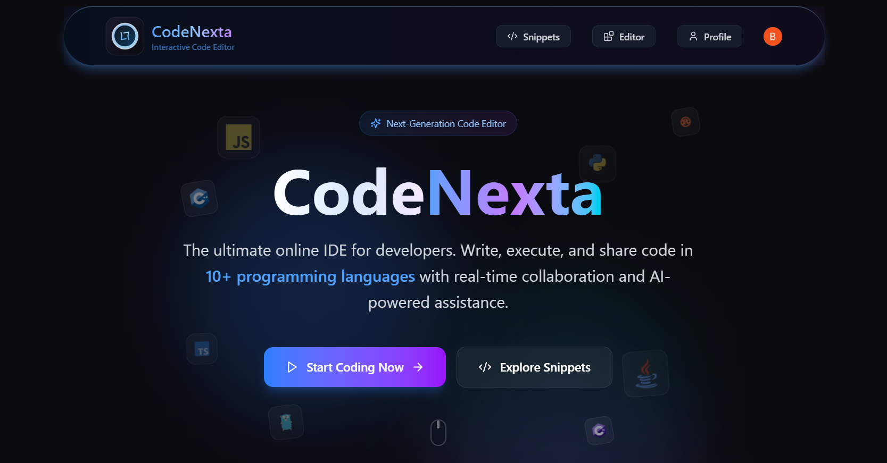
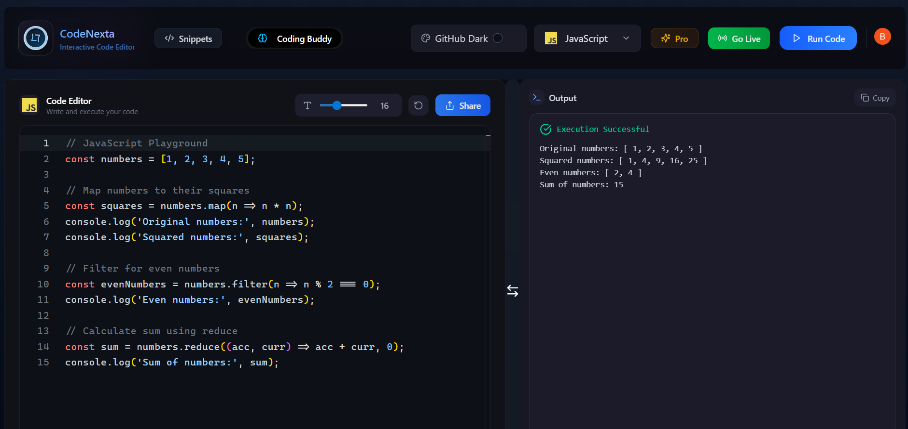
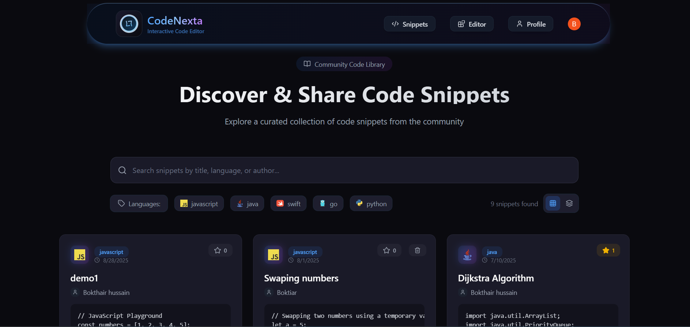

<div align="center">

  <h1>
    <b>CodeNexta</b>
  </h1>
  <p>
    The ultimate SaaS platform for developers. Write, execute, and share code in 10+ languages with real-time collaboration, an AI-powered assistant, and a thriving community.
  </p>
  
</div>


## 🚀 Live Demo

Experience CodeNexta live: **[https://codenexta.vercel.app/](https://codenexta.vercel.app/)**

## ✨ Key Features

CodeNexta is more than just an editor; it's a complete development ecosystem.

### 💻 Core Editor Experience
* **Multi-Language IDE:** Run 10+ languages instantly in the browser, from JavaScript and Python to Go and Rust.
* **Rich Editor:** Powered by Monaco (the engine behind VS Code) for a familiar, high-class editing experience.
* **Customizable UI:** Personalize your workspace with 5+ themes (VS Dark, Monokai, etc.) and adjustable font sizes.
* **Resizable Panels:** A flexible layout with resizable panels for your editor and output console.
* **Smart Output:** Cleanly separated output for successful code execution and detailed compiler/runtime errors.

### 🤖 AI-Powered Features (Powered by Google Gemini)
* **Coding Buddy:** An integrated AI assistant to answer questions, debug code, and suggest best practices contextually.
* **AI Error Fixer:** Automatically fix runtime and compiler errors with a single click.
* **Daily Rate Limiting:** A robust `useGeminiStore` (Zustand + LocalStorage) manages API usage to prevent abuse.

### 🤝 Real-Time Collaboration
* **Live Sessions:** Create a "Go Live" session and invite others to code with you in real-time.
* **Shared State:** Code is synchronized instantly across all participants using Convex.
* **Live Cursors & Selection:** See your collaborators' cursors and selections, just like in Google Docs.
* **Secure Access:** Control sessions with public/private settings and user-specific email invites.

### 🌐 Community & Sharing
* **Snippet Hub:** Share your code snippets with the community.
* **Discover:** Explore snippets from other users with search and language-based filtering.
* **Starring System:** Bookmark your favorite snippets for later.
* **Discussions:** Leave comments and discuss code on any snippet.

### 👤 User Dashboard
* **Personal Profile:** A dedicated page to view your activity.
* **Code History:** Review all your past code executions.
* **Starred Snippets:** Access all your bookmarked snippets in one place.
* **Developer Stats:** Get insights into your coding habits, like your most-used language, total executions, and more.
* **Feedback System:** Users can submit ratings and feedback, which you can see on the Testimonials section of the landing page.

### 💰 Smart Monetization & Growth
* **5-Day Free Trial:** New users automatically get a 5-day free trial of all Pro features upon sign-up.
* **Welcome Modal:** A one-time modal greets new users, explaining the trial and its benefits.
* **Pro Plan:** A one-time payment (powered by **Lemon Squeezy**) unlocks permanent access to premium features.
* **Feature Gating:**
    * **Backend Security:** Convex mutations for premium features (AI, Live Sessions, premium languages) are protected and check if a user is `isPro` or `isInTrial`.
    * **Frontend Experience:** The UI gracefully locks features and prompts users to upgrade with an "End of Trial" modal when their trial expires.
* **Webhook Integration:**
    * **Clerk Webhook:** Automatically syncs new user data to the Convex `users` table and starts their 5-day trial.
    * **Lemon Squeezy Webhook:** Listens for successful purchases to automatically upgrade a user to `isPro` in the database.

---

## 🚀 Tech Stack

This project is built with a modern, serverless-first, and type-safe stack.

| Category | Technology |
| :--- | :--- |
| **Framework** | [**Next.js**](https://nextjs.org/) (App Router) |
| **Backend & DB** | [**Convex**](https://www.convex.dev/) (Real-time serverless backend) |
| **Authentication** | [**Clerk**](https://clerk.com/) |
| **Language** | [**TypeScript**](https://www.typescriptlang.org/) |
| **Code Editor** | [**Monaco Editor**](https://microsoft.github.io/monaco-editor/) |
| **AI Features** | [**Google Gemini API**](https://ai.google.dev/) |
| **Payments** | [**Lemon Squeezy**](https://www.lemonsqueezy.com/) (via Webhooks) |
| **UI** | [**Tailwind CSS**](https://tailwindcss.com/) & [**shadcn/ui**](https://ui.shadcn.com/) |
| **Animation** | [**Framer Motion**](https://www.framer.com/motion/) |
| **State Management** | [**Zustand**](https://zustand-demo.pmnd.rs/) |


---

## 📸 Screenshots

| Code Editor  |
| :---: |
|  |

| Snippets Page |
| :---: |
|  |

| Proflie Page |
| :---: |
|  |


---

## 💻 Getting Started

Follow these steps to get a local copy up and running.

### Prerequisites

* Node.js (v18 or higher)
* npm / yarn / pnpm
* A Convex account
* A Clerk account
* A Google Gemini API Key

### Installation

1.  **Clone the repo**
    ```sh
    git clone https://github.com/bhsajuu/saas-code-editor.git
    cd saas-code-editor
    ```

2.  **Install dependencies**
    ```sh
    npm install
    ```

3.  **Set up Convex**
    * Run `npx convex dev`
    * This will prompt you to log in and create a new project.
    * It will create a `.env.local` file for you.

4.  **Set up Clerk**
    * Create a new application in your Clerk Dashboard.
    * Go to "API Keys" and copy your **Publishable Key** and **Secret Key**.
    * Add them to `.env.local`:
        ```env
        # .env.local
        NEXT_PUBLIC_CLERK_PUBLISHABLE_KEY=pk_...
        CLERK_SECRET_KEY=sk_...
        ```
    * In the Clerk Dashboard, go to "JWT Templates", create a new template, and select "Convex".

5.  **Set up Environment Variables**
    * In your Convex project dashboard, add your Clerk `CLERK_SECRET_KEY` and your `NEXT_PUBLIC_GEMINI_API_KEY`.
    * Add your Clerk issuer URL to `convex/auth.config.ts`.
    * Your `.env.local` file should look something like this:

    ```env
    # .env.local
    NEXT_PUBLIC_CONVEX_URL=https://<your-project>.convex.cloud

    # Clerk
    NEXT_PUBLIC_CLERK_PUBLISHABLE_KEY=pk_...
    CLERK_SECRET_KEY=sk_...
    NEXT_PUBLIC_CLERK_FRONTEND_API_URL=https://<your-clerk-url>.clerk.accounts.dev

    # Gemini AI
    NEXT_PUBLIC_GEMINI_API_KEY=AIza...
    ```

6.  **Push the Convex Schema**
    ```sh
    npx convex deploy
    ```

7.  **Run the development server**
    ```sh
    npm run dev
    ```

Your app should now be running on `http://localhost:3000`.

---

## 📄 License

This project is licensed under the MIT License. See the `LICENSE` file for details.
